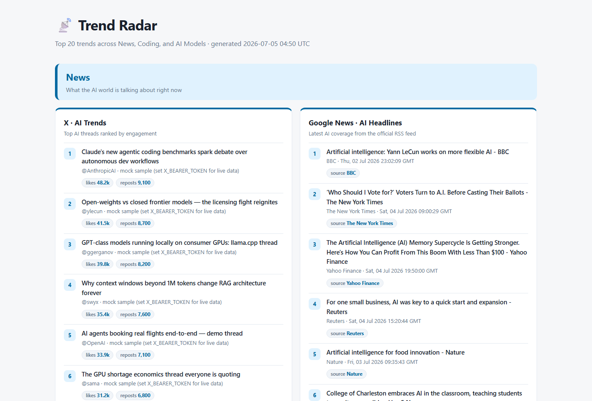
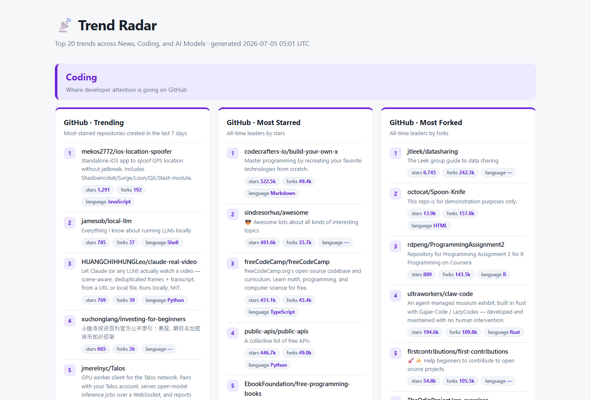
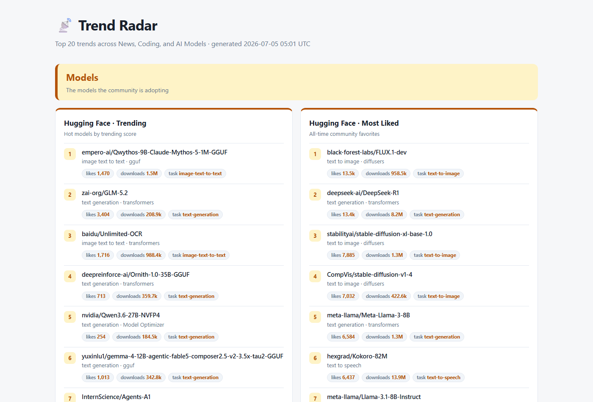

# 📡 Trend Radar — an MCP Server for AI, Coding & Model Trends

**Trend Radar** is a [Model Context Protocol (MCP)](https://modelcontextprotocol.io) server written in Python.
It gives any MCP client — Claude Desktop, Claude Code, the MCP Inspector, or your own agent —
eight tools that fetch **Top 20 trend lists** from across the AI ecosystem and render them
into a polished, self-contained **HTML dashboard**:



## What is this MCP server?

MCP is an open protocol that lets AI assistants call external tools. This server plugs into
your assistant and answers questions like *"what's trending in AI right now?"* with live,
structured data instead of stale training knowledge. It covers three categories:

| Category | Tool | Data source |
|---|---|---|
| 📰 **News** | `get_x_ai_trends` | X (Twitter) API v2 — live with a bearer token, curated mock fallback without |
| 📰 **News** | `get_google_news_ai_trends` | Official Google News RSS feed, parsed with `feedparser` |
| 💻 **Coding** | `get_github_trends` | GitHub Search API — most-starred repos created in the last 7 days |
| 💻 **Coding** | `get_github_most_starred` | GitHub Search API — all-time star leaders |
| 💻 **Coding** | `get_github_most_forked` | GitHub Search API — all-time fork leaders |
| 🤗 **Models** | `get_hf_trending_models` | Hugging Face Hub API (`sort=trendingScore`) |
| 🤗 **Models** | `get_hf_most_liked_models` | Hugging Face Hub API (`sort=likes`) |
| 🎨 **Web** | `generate_trends_dashboard` | Aggregates all 7 feeds → one `index.html` |

Every data tool returns clean JSON:

```json
{
  "source": "github_trending",
  "count": 20,
  "items": [
    {
      "rank": 1,
      "title": "owner/repo",
      "url": "https://github.com/owner/repo",
      "description": "What the project does",
      "metrics": { "stars": "12.4k", "forks": "980", "language": "Python" }
    }
  ]
}
```

If a feed fails, the tool returns `{"source": ..., "error": ..., "items": []}` instead of
crashing — and the dashboard shows an inline note for that card while the rest of the page
still renders.

## Project structure

```
mcp_Trend_Radar/
├── server.py                 # FastMCP server — registers all 8 tools
├── services/
│   ├── models.py             # TrendItem dataclass + badge formatting
│   ├── http_client.py        # shared requests wrapper + ServiceError
│   ├── x.py                  # X trends (live API / mock fallback)
│   ├── google_news.py        # Google News RSS via feedparser
│   ├── github.py             # GitHub Search API (3 views)
│   ├── huggingface.py        # HF Hub API (trending / most liked)
│   └── dashboard.py          # aggregation + HTML generation + local server
├── docs/images/              # screenshots used in this README
├── requirements.txt
└── .env.example
```

---

## How to use it — step by step

### Step 1 · Install

```powershell
git clone https://github.com/girlmoony/mcp_Trend_Radar.git
cd mcp_Trend_Radar
python -m venv .venv
.venv\Scripts\Activate.ps1
pip install -r requirements.txt
copy .env.example .env    # optional — every tool works without tokens
```

### Step 2 · Try it standalone (no MCP client needed)

The dashboard module doubles as a CLI. This fetches all seven feeds and serves the result:

```powershell
python -m services.dashboard          # builds output/index.html + serves on :8000
python -m services.dashboard --build  # build only
```

Open <http://127.0.0.1:8000> and you'll see the page from the screenshot above:
three color-coded categories, numbered Top-20 lists, and engagement badges.

**💻 Coding section** — three GitHub views side by side, with stars / forks / language badges:



**🤗 Models section** — Hugging Face trending and most-liked models, with likes / downloads / task badges:



### Step 3 · Register with Claude Desktop

Add the server to `claude_desktop_config.json`
(Windows: `%APPDATA%\Claude\claude_desktop_config.json`, macOS: `~/Library/Application Support/Claude/claude_desktop_config.json`):

```json
{
  "mcpServers": {
    "trend-radar": {
      "command": "C:\\path\\to\\python.exe",
      "args": ["C:\\path\\to\\mcp_Trend_Radar\\server.py"]
    }
  }
}
```

Restart Claude Desktop. The 8 tools appear under the 🔨 tools menu, and you can simply ask:

> *"What are the trending GitHub repos this week?"*
> *"Show me the most liked Hugging Face models."*
> *"Generate the trends dashboard and tell me where the file is."*

### Step 4 · Register with Claude Code (CLI)

```powershell
claude mcp add trend-radar -- python "C:\path\to\mcp_Trend_Radar\server.py"
```

### Step 5 · Debug with the MCP Inspector

```powershell
mcp dev server.py
```

This opens the Inspector web UI where you can list the tools, call each one, and inspect
the raw JSON responses interactively.

---

## The dashboard tool

Calling `generate_trends_dashboard` (from any MCP client, or via the CLI in Step 2) writes a
**single self-contained `index.html`**:

- Semantic HTML5 + custom CSS variables — **zero JavaScript, zero external assets**
- Distinct colored sections per platform: 🔵 News, 🟣 Coding, 🟡 Models
- Numbered lists with linked titles, snippets, and engagement badges
  (stars, forks, likes, downloads, reposts)
- Automatic dark mode via `prefers-color-scheme` and a print-friendly layout
- Per-feed error isolation — one failing API never blanks the page

The tool returns a JSON build summary with the absolute output path and per-section item counts.

## Configuration (all optional)

| Variable | Effect |
|---|---|
| `GITHUB_TOKEN` | Raises the GitHub Search rate limit from 10 to 30 requests/min |
| `X_BEARER_TOKEN` | Switches X trends from curated mock data to the live X API v2 |
| `HF_TOKEN` | Authenticated Hugging Face Hub requests |

Copy `.env.example` to `.env` and fill in what you have — the server loads it automatically.

## Requirements

- Python 3.10+
- `mcp` · `requests` · `feedparser` · `python-dotenv` (see `requirements.txt`)

## Related projects

This repo previously included **AgentLens**, a local cost/efficiency scanner for Claude Code
sessions. It has been split out into its own repository, since it's a general-purpose tool
unrelated to trend research: <https://github.com/girlmoony/agentlens>

## License

MIT
